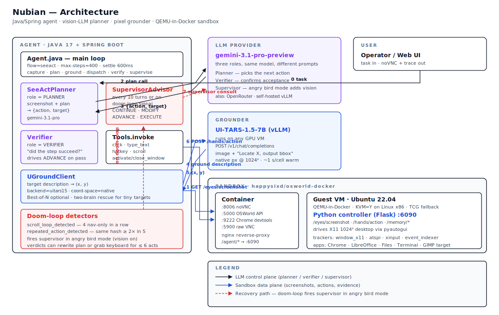

# Nubian (WIP)
**Autonomous computer-use agent**

Most agents read the page. Nubian watches the screen. It skips a11y, CDP, and CodeAct, and uses vision and a virtual keyboard instead. The same channel a person uses. Today it drives LibreOffice Calc, Writer, Chrome, terminals, and the file manager. The target is to do the same in GIMP, Photoshop, and Blender, where no DOM or accessibility tree exists.

[](https://github.com/user-attachments/assets/8aff5544-69db-4354-b133-8c14052be350)

[](https://github.com/user-attachments/assets/d446d710-7ce6-4ec6-976b-ad0c52d56b92)


*Above: Nubian finishing a real online job application end to end. Left pane is the live reasoning trace; right pane is the agent's Ubuntu desktop. Along the way it wrote the cover letter in LibreOffice Writer, downloaded the required files, filled the form fields, and reached the "successfully applied" confirmation.*

Full breakdown: [`docs/ARCHITECTURE.md`](docs/ARCHITECTURE.md)

---

## Architecture

```
        ┌─────────────────────────────────────────────┐
        │  Agent (this repo, Java 17 + Spring Boot)   │
        │                                             │
        │  seeact loop = per-turn planner call:       │
        │    raw screenshot ──> Gemini Pro planner    │
        │    target description ──> UI-TARS grounder  │
        │    {action, x, y, ...} ──> Tools.invoke     │
        │                                             │
        │  Supervisor (every N turns OR on doom-loop):│
        │    consults Gemini Pro with screenshot      │
        │    can MODIFY plan / ADVANCE / EXECUTE keys │
        └──────────────┬──────────────────────────────┘
                       │  HTTP
        ┌──────────────▼──────────────┐
        │  Sandbox controller          │  /hands/action, /eyes/screenshot
        │  (Docker container w/        │  /eyes/evidence (windows, fs, ...)
        │   X11 + pyautogui)           │
        └──────────────────────────────┘
```

Three LLM roles:
- **Planner** (`gemini-3.1-pro-preview`) — picks the next action from the
  screenshot and current checklist state.
- **Verifier** (same model) — confirms each acceptance state.
- **Supervisor** (same model) — fires every 10 turns OR on detected doom-loops
  (scroll-only streak ≥ 4, or repeated action signature). In angry mode the
  screenshot rides along so the supervisor sees ground truth. It can rewrite
  the active step text (MODIFY), mark it done (ADVANCE), or take over the
  keyboard for up to 6 actions (EXECUTE).

---

## Quick start

```bash
# 1. Build
mvn -o package -DskipTests

# 2. Fill in your API key
cp config/application-dev.properties.example config/application-dev.properties
$EDITOR config/application-dev.properties   # set GEMINI_API_KEY or OPENROUTER_API_KEY

# 3. Bring up the sandbox
docker compose up -d sandbox

# 4. Deploy the UI-TARS grounder on a GPU VM (required for grounded clicks)
#    See deployment/GROUNDER_DEPLOY.md. Set nubian.uground.enabled=false to skip.

# 5. Start the agent
./start.sh
# UI on http://localhost:8080
```

---

## Tool contract

The agent dispatches **actions** to the sandbox via `Tools.invoke(name, args)`.
Most-used:

| Action | Args | Notes |
|--------|------|-------|
| `click` | `{x, y, button?}` | pixel coords from the grounder |
| `type_text` | `{text, mode?: "append"\|"replace"}` | replace = Ctrl+A → Delete → type |
| `hotkey` | `{combo: "ctrl+l"\|"enter"\|...}` | |
| `scroll` | `{direction: "up"\|"down"\|"left"\|"right", amount?: <int>}` | dy/dx accepted as legacy; always default to "down"/"right" |
| `activate_window` | `{name}` | exact title from `/eyes/evidence` |
| `close_window` | `{name}` | window manager close (more reliable than clicking the X) |
| `write_file` | `{path, content}` | absolute path in sandbox FS |
| `wait` | `{ms}` | |

Sign-based scroll inference (`dy<0 → up`) was the source of a long doom-loop
in v1: the planner inconsistently emitted negative `dy` intending either
direction. v2 forces explicit `direction`.

---

## Loop-detection signals

These trigger the supervisor in **angry mode** but never leak as advisory
text to the planner (text hints were ignored in v1):

- `scroll_loop_detected` — 4 consecutive navigation-only actions
- `repeated_action_detected` — same non-navigation routeHash seen ≥ 2× in
  last 5 turns

On either signal the supervisor consult fires immediately (not waiting for
the next mod-10 turn) and receives the current screenshot.

---

## Configuration knobs

All in `config/application-dev.properties`:

```properties
nubian.agent.flow=seeact                       # only supported flow
nubian.agent.max-steps=400                     # hard cap per task
nubian.agent.observation-settle-ms=600         # wait before post-action screenshot
nubian.agent.supervisor.enabled=true
nubian.agent.supervisor.interval=10            # fire every 10 planner calls
nubian.uground.enabled=true                    # disable for screenshot-only
nubian.agent.best-of-n=1                       # >1 samples N candidates per turn
```

---

## Repo layout

```
.
├── nubian-app/                # Spring Boot app (the agent itself)
│   └── src/main/java/com/nubian/ai/app/
│       ├── Agent.java         # main loop + flow routing
│       ├── SeeActPlanner.java # per-turn planner LLM call
│       ├── SupervisorAdvisor.java
│       ├── Tools.java         # the action dispatch layer
│       ├── UGroundClient.java # pixel grounder client
│       └── Sandbox.java       # HTTP client for the sandbox controller
├── omniparser-server/         # optional UI-element parser sidecar
├── config/                    # local config (gitignored real, .example checked in)
├── docs/                      # design notes + handoff docs
├── scripts/                   # diff viewers, jitter probes
├── docker-compose.yml         # sandbox + sidecars
├── pom.xml
└── start.sh
```




---

## License

MIT.
